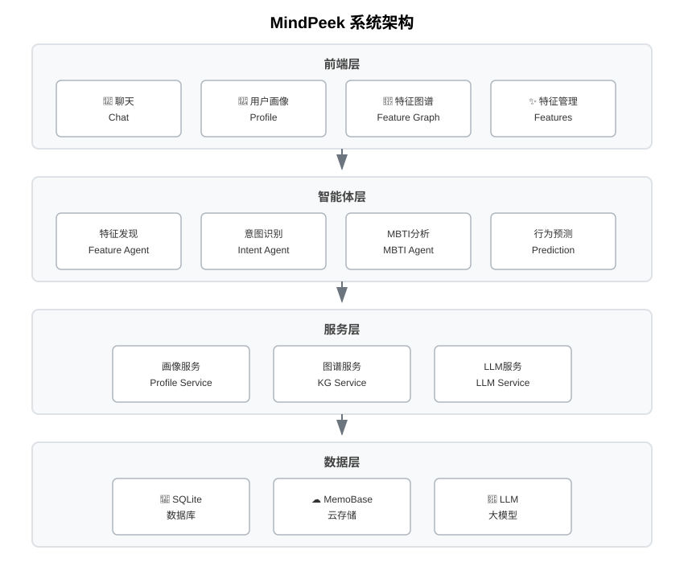

# MindPeek - AI 用户画像引擎

<p align="center">
  
  
  
  
</p>

<p align="center">
  <strong>让 AI 真正读懂人心</strong>
</p>

<p align="center">
  <a href="README_en.md">English</a> | <a href="README.md">中文</a> | <a href="README_ja.md">日本語</a>
</p>

***

## ✨ 核心亮点

### 👤 智能用户画像

MindPeek 通过 LLM 深度解析对话，自动构建持续进化的个人画像：

| 特征维度     | 说明          |
| -------- | ----------- |
| **性格特质** | MBTI、大五人格分析 |
| **行为习惯** | 生活习惯、决策模式   |
| **兴趣爱好** | 娱乐偏好、学习方向   |
| **价值观**  | 人生观、世界观     |
| **情感状态** | 当前情绪、心理需求   |
| **社会关系** | 人际网络、互动模式   |

### 🔮 AI 行为预测

基于用户画像，预测用户未来的行为和想法：

- **行为预测**：用户可能采取的行动
- **想法预测**：用户可能产生的思考
- **情感预测**：用户可能出现的情绪
- **决策预测**：用户可能做出的选择

### 💬 个性化对话

AI 会根据你的画像提供贴心回复：

- 自然融入你的兴趣和习惯
- 根据你的性格调整语气风格
- 预判你的需求并主动建议
- 像老朋友一样自然对话

***

## 🖼️ 效果展示

<p align="center">
  <table>
    <tr>
      <td align="center">
        
        <br/>
        <strong>聊天界面</strong>
      </td>
      <td align="center">
        
        <br/>
        <strong>根据用户画像智能对话*</strong>
      </td>
      <td align="center">
        
        <br/>
        <strong>特征管理</strong>
      </td>
    </tr>
    <tr>
      <td align="center">
        
        <br/>
        <strong>特征图谱</strong>
      </td>
      <td align="center">
        
        <br/>
        <strong>用户画像</strong>
      </td>
      <td align="center">
        
        <br/>
        <strong>行为预测</strong>
      </td>
    </tr>
  </table>
</p>

<p style="color: #666; font-size: 12px; text-align: left; padding-left: 40px;">
* 用户对话时会根据用户画像信息个性化进行回答，图中已根据用户居住在上海，生活节奏快等之前已经提取到的用户特征信息进行回答，使得答案更贴近用户实际。
</p>

***

## 🚀 快速开始

### 1. 安装依赖

```bash
pip install -r requirements.txt
cd frontend
npm install
```

### 2. 配置系统

```bash
copy config\config.example.json config\config.json
```

编辑 `config/config.json`，填入你的 LLM API 配置。

### 3. 启动服务

```bash
python -m uvicorn main:app --host 0.0.0.0 --port 8000
cd frontend
npm run dev
```

### 4. 开始使用

- 🌐 前端界面：<http://localhost:3000>
- 📖 API 文档：<http://localhost:8000/docs>

### 5. 快速测试（推荐）

运行交互式测试脚本，快速体验完整功能：

```bash
python tests/interactive_conversation_test.py
```

该脚本将自动：

- 发送 30 轮模拟对话
- 自动提取用户特征（MBTI、兴趣爱好、价值观等）
- 生成用户画像和知识图谱
- 触发智能提醒和画像趋势分析

测试完成后，访问以下页面查看结果：

- 📊 特征管理：<http://localhost:3000/features>
- 🔗 知识图谱：<http://localhost:3000/knowledge-graph>

***

## 📊 系统架构



***

## 🛠️ 技术栈

| 层级     | 技术                                  |
| ------ | ----------------------------------- |
| **后端** | FastAPI + LangGraph + SQLAlchemy    |
| **前端** | Vue 3 + Element Plus + ECharts      |
| **AI** | OpenAI 兼容接口 + Sentence Transformers |
| **存储** | SQLite + MemoBase 云同步               |

***

## ⚡ 系统特性

### 👤 智能用户画像构建

- **深度对话解析**：通过持续对话自动提取用户特征
- **多维度画像**：涵盖性格、兴趣、价值观、情感状态等
- **持续进化**：用户画像随对话不断更新和完善

### 🎨 响应式界面设计

- **桌面端**：完整功能展示，左右分栏布局
- **移动端**：自适应优化，核心功能优先
- **人性化交互**：智能滚动，不打断用户阅读

### 🔔 智能情绪提醒

- **实时情绪监测**：自动识别负面情绪状态
- **及时健康预警**：发现异常时主动提醒
- **个性化建议**：根据用户情况提供关怀

### 🔗 可视化特征图谱

- **知识图谱展示**：直观呈现特征之间的关联
- **特征分布图表**：可视化展示用户画像构成
- **可交互探索**：点击查看详细特征信息

***

## 📁 项目结构

```
MindPeek/
├── backend/
│   ├── agents/          # Agent 智能体
│   │   ├── chat_graph.py          # 对话流程
│   │   ├── feature_discovery.py   # 特征发现（用户画像构建）
│   │   ├── prediction_agent.py    # 行为预测
│   │   └── intent_classifier.py   # 意图分类
│   ├── services/        # 服务层
│   │   ├── profile_service.py     # 用户画像服务
│   │   └── llm_service.py        # LLM 服务
│   ├── profile/          # 用户画像核心模块
│   └── models/           # 数据模型
├── frontend/             # Vue 3 前端
│   ├── views/            # 页面视图
│   │   ├── chat/         # 聊天界面
│   │   ├── profile/      # 用户画像页面
│   │   └── features/     # 特征管理页面
│   └── components/       # 组件
└── config/               # 配置文件
```

***

## 📜 License

[GNU General Public License v3.0](LICENSE)

***

<p align="center">
  <strong>MindPeek</strong> - 让 AI 真正理解你
</p>
