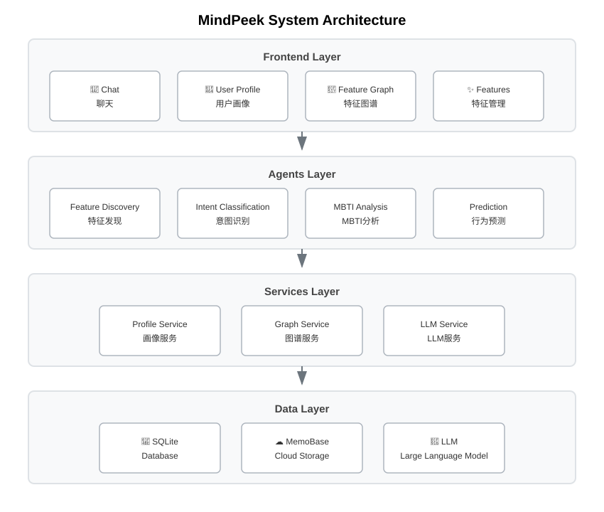

# MindPeek - Your AI Partner Who Understands You 🎯

<p align="center">
  
  
  
  
</p>

<p align="center">
  <strong>AI That Truly Understands Your Users</strong>
</p>

<p align="center">
  <a href="README_en.md">English</a> | <a href="README.md">中文</a> | <a href="README_ja.md">日本語</a>
</p>

---

## ✨ Core Features

### 🧠 Intelligent User Profiling

MindPeek leverages LLM to decode conversations and build continuously evolving user profiles:

| Dimension | Description |
|-----------|-------------|
| **Personality** | MBTI, Big Five analysis |
| **Behavior** | Habits, decision patterns |
| **Interests** | Entertainment, learning preferences |
| **Values** | Life philosophy, worldview |
| **Emotions** | Current mood, psychological needs |
| **Relationships** | Social network, interaction patterns |

### 🔮 AI Behavior Prediction

Based on user profiles, predict future behaviors and thoughts:
- **Behavior Prediction**: Actions the user might take
- **Thought Prediction**: Ideas the user might have
- **Emotion Prediction**: Emotional states the user might experience
- **Decision Prediction**: Choices the user might make

### 💬 Personalized Conversation

AI provides thoughtful responses based on your profile:
- Naturally incorporates your interests and habits
- Adjusts tone based on your personality
- Anticipates your needs proactively
- Converses naturally like an old friend

---

## 🖼️ Demo Gallery

<p align="center">
  <table>
    <tr>
      <td align="center">
        
        <br/>
        <strong>Chat Interface</strong>
      </td>
      <td align="center">
        
        <br/>
        <strong>Personalized Conversation*</strong>
        <br/>
        <small style="color: #666;">* When users chat, responses are personalized based on user profile information. In the image, the answer is tailored to the user who lives in Shanghai and has a fast-paced lifestyle, making the response more relevant to the user's actual situation.</small>
      </td>
      <td align="center">
        
        <br/>
        <strong>Feature Management</strong>
      </td>
    </tr>
    <tr>
      <td align="center">
        
        <br/>
        <strong>Feature Graph</strong>
      </td>
      <td align="center">
        
        <br/>
        <strong>User Profile</strong>
      </td>
      <td align="center">
        
        <br/>
        <strong>Behavior Prediction</strong>
      </td>
    </tr>
  </table>
</p>

---

## 🚀 Quick Start

### 1. Install Dependencies

```bash
pip install -r requirements.txt
cd frontend
npm install
```

### 2. Configure System

```bash
copy config\config.example.json config\config.json
```

Edit `config/config.json` with your LLM API configuration.

### 3. Start Services

```bash
python -m uvicorn main:app --host 0.0.0.0 --port 8000
cd frontend
npm run dev
```

### 4. Get Started

- 🌐 Frontend: http://localhost:3000
- 📖 API Docs: http://localhost:8000/docs

### 5. Quick Test (Recommended)

Run the interactive test script to quickly experience all features:

```bash
python tests/interactive_conversation_test.py
```

This script will automatically:
- Send 30 rounds of simulated conversations
- Extract user features (MBTI, interests, values, etc.)
- Generate user profile and knowledge graph
- Trigger smart alerts and profile trend analysis

After the test, visit these pages to see results:
- 📊 Features: http://localhost:3000/features
- 🔗 Knowledge Graph: http://localhost:3000/knowledge-graph

---

## 📊 System Architecture



---

## 🛠️ Tech Stack

| Layer | Technology |
|-------|------------|
| **Backend** | FastAPI + LangGraph + SQLAlchemy |
| **Frontend** | Vue 3 + Element Plus + ECharts |
| **AI** | OpenAI Compatible API + Sentence Transformers |
| **Storage** | SQLite + MemoBase Cloud Sync |

---

## ⚡ System Features

### 👤 Intelligent User Profiling
- **Deep Conversation Analysis**: Auto-extract user features through continuous dialogue
- **Multi-dimensional Profiling**: Covers personality, interests, values, emotional states, etc.
- **Continuous Evolution**: User profile constantly updates and improves with conversations

### 🎨 Responsive UI Design
- **Desktop**: Full feature display with left-right split layout
- **Mobile**: Adaptive optimization, core features prioritized
- **Humanized Interaction**: Smart scrolling, no interruption to user reading

### 🔔 Smart Emotional Alerts
- **Real-time Emotion Monitoring**: Auto-identify negative emotional states
- **Timely Health Warnings**: Proactive alerts when abnormalities are detected
- **Personalized Suggestions**: Care based on user's situation

### 🔗 Visual Feature Graph
- **Knowledge Graph Display**: Intuitive presentation of feature relationships
- **Feature Distribution Charts**: Visualize user profile composition
- **Interactive Exploration**: Click to view detailed feature info

---

## 📁 Project Structure

```
MindPeek/
├── backend/
│   ├── agents/          # Agent modules
│   │   ├── chat_graph.py          # Conversation flow
│   │   ├── feature_discovery.py   # Feature discovery
│   │   ├── prediction_agent.py    # Behavior prediction
│   │   └── intent_classifier.py   # Intent classification
│   ├── services/        # Service layer
│   ├── knowledge_graph/ # Knowledge graph
│   └── models/          # Data models
├── frontend/            # Vue 3 frontend
└── config/              # Configuration files
```

---

## 📜 License

[GNU General Public License v3.0](LICENSE)

---

<p align="center">
  <strong>MindPeek</strong> - Let AI truly understand you
</p>
