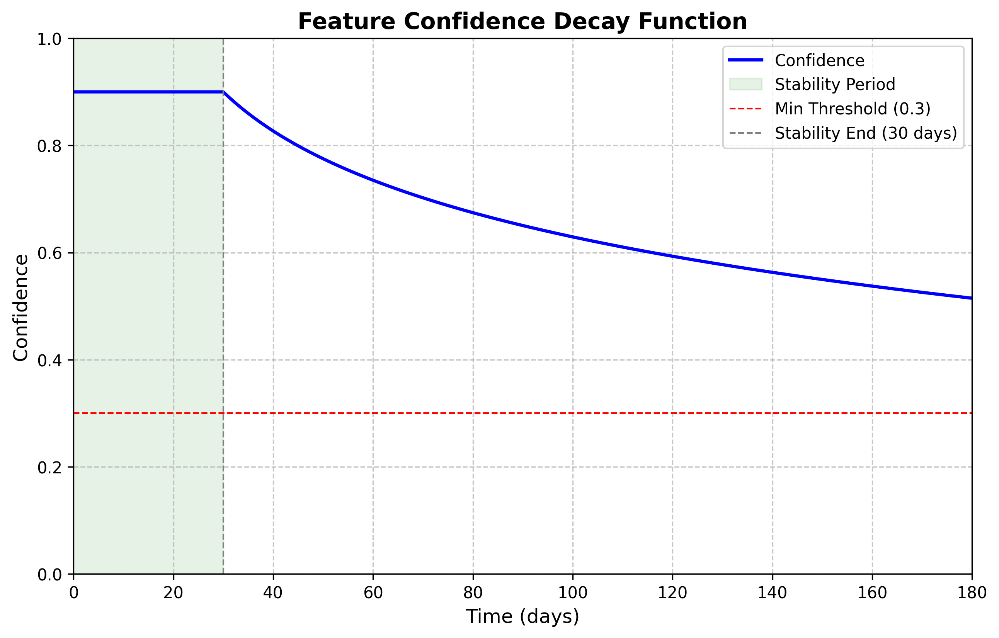

# MindPeek - Your AI Partner Who Understands You 🎯

<p align="center">
  
  
  
  
</p>

<p align="center">
  <strong>AI That Truly Understands Your Users</strong>
</p>

<p align="center">
  <a href="README_en.md">English</a> | <a href="README.md">中文</a> | <a href="README_ja.md">日本語</a>
</p>

---

## ✨ Core Features

### 🧠 Intelligent User Profiling

MindPeek leverages LLM to decode conversations and build continuously evolving user profiles:

| Dimension | Description |
|-----------|-------------|
| **Personality** | MBTI, Big Five analysis |
| **Behavior** | Habits, decision patterns |
| **Interests** | Entertainment, learning preferences |
| **Values** | Life philosophy, worldview |
| **Emotions** | Current mood, psychological needs |
| **Relationships** | Social network, interaction patterns |

### 🔮 AI Behavior Prediction

Based on user profiles, predict future behaviors and thoughts:
- **Behavior Prediction**: Actions the user might take
- **Thought Prediction**: Ideas the user might have
- **Emotion Prediction**: Emotional states the user might experience
- **Decision Prediction**: Choices the user might make

### 💬 Personalized Conversation

AI provides thoughtful responses based on your profile:
- Naturally incorporates your interests and habits
- Adjusts tone based on your personality
- Anticipates your needs proactively
- Converses naturally like an old friend

---

## 🚀 Quick Start

### 1. Install Dependencies

```bash
pip install -r requirements.txt
cd frontend && npm install
```

### 2. Configure System

```bash
copy config\config.example.json config\config.json
```

Edit `config/config.json` with your LLM API configuration.

### 3. Start Services

```bash
python -m uvicorn main:app --host 0.0.0.0 --port 8000
cd frontend && npm run dev
```

### 4. Get Started

- 🌐 Frontend: http://localhost:3000
- 📖 API Docs: http://localhost:8000/docs

---

## 📊 System Architecture

```
┌─────────────────────────────────────────────────────────────────┐
│                        MindPeek Frontend                         │
│   💬 Chat  │  👤 Profile  │  🔗 Knowledge Graph  │  ✨ Features  │  ⚙️ Settings   │
└─────────────────────────────────────────────────────────────────┘
                                │
                                ▼
┌─────────────────────────────────────────────────────────────────┐
│                    🤖 LangGraph Orchestrator                     │
│                                                                  │
│   ┌─────────────┐  ┌─────────────┐  ┌─────────────────────────┐  │
│   │   Feature   │  │   Latent    │  │      Correlation       │  │
│   │  Discovery  │  │   Intent    │  │        Agent           │  │
│   │   Agent     │  │   Agent     │  │                        │  │
│   └─────────────┘  └─────────────┘  └─────────────────────────┘  │
│                                                                  │
│   ┌─────────────────────────┐  ┌─────────────────────────────┐  │
│   │        MBTI /           │  │        Prediction           │  │
│   │       BigFive           │  │          Agent              │  │
│   │        Agent            │  │                             │  │
│   └─────────────────────────┘  └─────────────────────────────┘  │
└─────────────────────────────────────────────────────────────────┘
                                │
        ┌───────────────────────┼───────────────────────┐
        ▼                       ▼                       ▼
┌─────────────────┐  ┌─────────────────┐  ┌─────────────────────┐
│    💾 SQLite   │  │   📡 MemoBase  │  │       🧠 LLM        │
│   Local Store  │  │   Remote Sync  │  │   (DeepSeek etc.)   │
└─────────────────┘  └─────────────────┘  └─────────────────────┘
```

---

## 🛠️ Tech Stack

| Layer | Technology |
|-------|------------|
| **Backend** | FastAPI + LangGraph + SQLAlchemy |
| **Frontend** | Vue 3 + Element Plus + ECharts |
| **AI** | OpenAI Compatible API + Sentence Transformers |
| **Storage** | SQLite + MemoBase Cloud Sync |

---

## 🆕 Latest Features

### Smart Intent Classification
Intelligent intent classification based on **Embedding semantic understanding**:
- Hybrid approach: Rule-first + Embedding semantic judgment
- High performance: 90%+ requests respond in milliseconds
- Smart understanding: Accurate recognition of synonyms and variants

### Feature Decay Mechanism


- **Stability Period**: Feature confidence remains unchanged
- **Decay Period**: Logarithmic decay, eventually converging to minimum threshold
- **Lazy Update**: Calculate on access, reduce database writes

---

## 📁 Project Structure

```
MindPeek/
├── backend/
│   ├── agents/          # Agent modules
│   │   ├── chat_graph.py          # Conversation flow
│   │   ├── feature_discovery.py   # Feature discovery
│   │   ├── prediction_agent.py    # Behavior prediction
│   │   └── intent_classifier.py   # Intent classification
│   ├── services/        # Service layer
│   ├── knowledge_graph/ # Knowledge graph
│   └── models/          # Data models
├── frontend/            # Vue 3 frontend
└── config/              # Configuration files
```

---

## 📜 License

[GNU General Public License v3.0](LICENSE)

---

<p align="center">
  <strong>MindPeek</strong> - Let AI truly understand you
</p>
