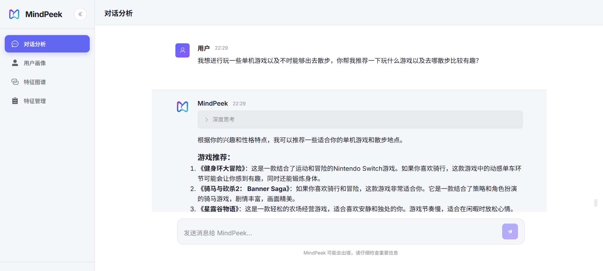
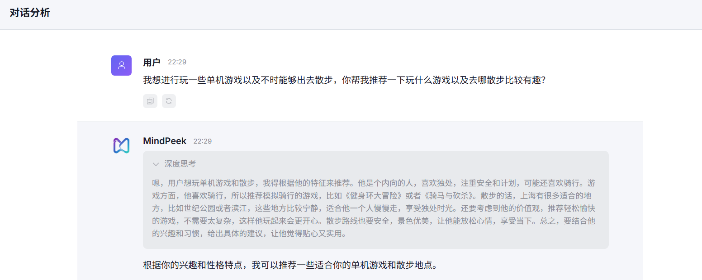
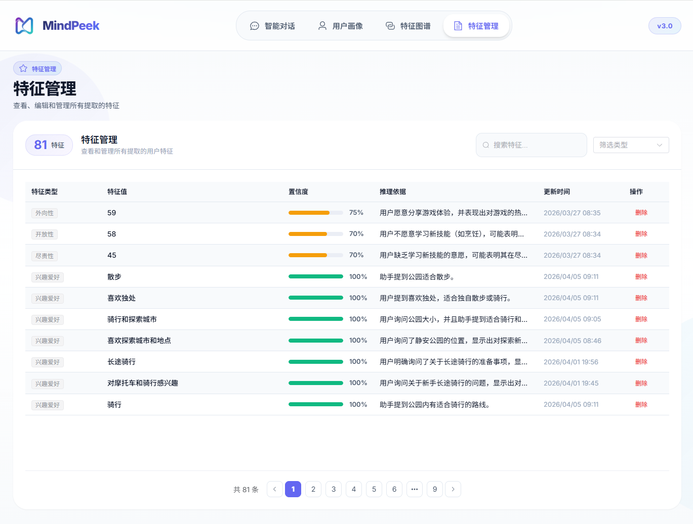
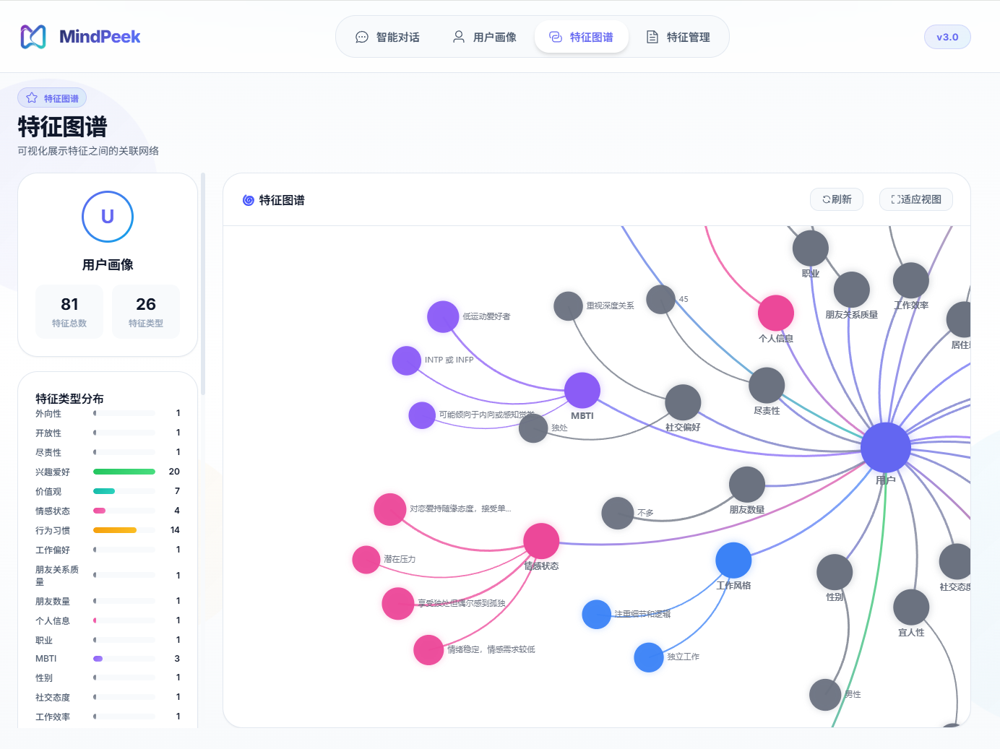
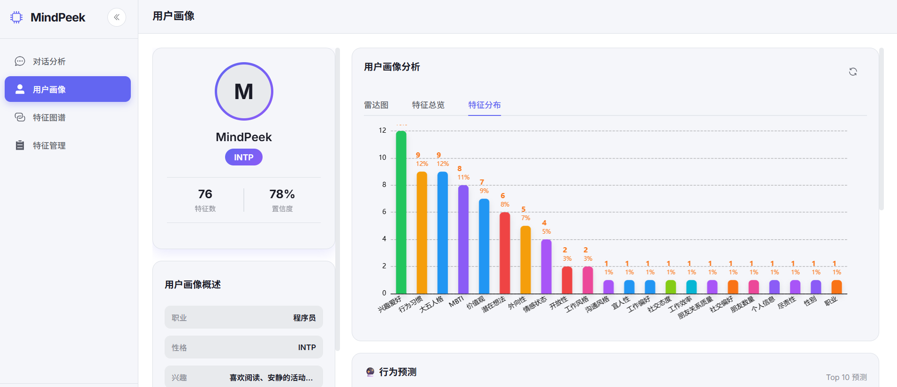
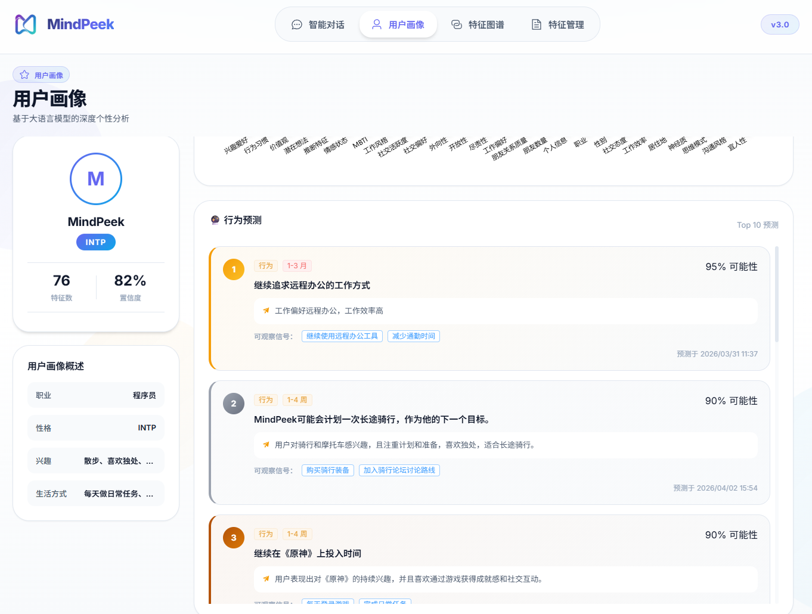
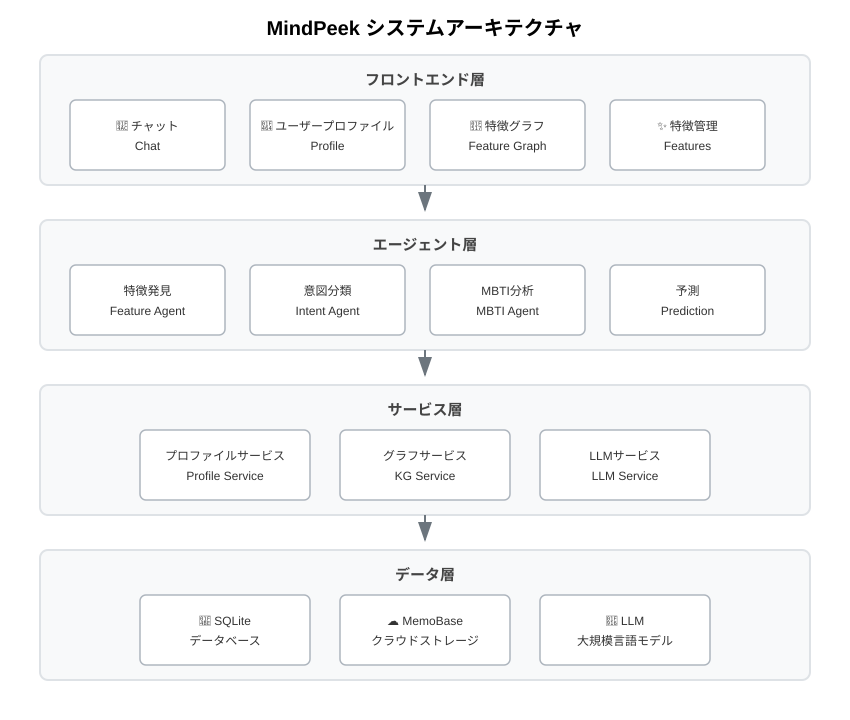

# MindPeek - AI ユーザープロファイリングエンジン

<p align="center">
  
</p>

<p align="center">
  
  
  
  
</p>

<p align="center">
  <strong>AI が本当にあなたを理解する</strong>
</p>

<p align="center">
  <a href="README_en.md">English</a> | <a href="README.md">中文</a> | <a href="README_ja.md">日本語</a>
</p>

---

## ✨ 主な機能

### 👤 インテリジェントユーザープロファイリング

MindPeekはLLMを活用して会話を解析し、継続的に進化するユーザープロファイルを構築します：

| 次元 | 説明 |
|------|------|
| **性格** | MBTI、ビッグファイブ分析 |
| **行動** | 習慣、意思決定パターン |
| **興味** | エンターテイメント、学習の好み |
| **価値観** | 人生観、世界観 |
| **感情** | 現在の気分、心理的ニーズ |
| **関係性** | ソーシャルネットワーク、交流パターン |

### 🔮 AI行動予測

ユーザープロファイルに基づいて、将来の行動や思考を予測：
- **行動予測**：ユーザーがとる可能性のある行動
- **思考予測**：ユーザーが持つ可能性のあるアイデア
- **感情予測**：ユーザーが経験する可能性のある感情状態
- **意思決定予測**：ユーザーが下す可能性のある選択

### 💬 パーソナライズされた会話

AIはあなたのプロファイルに基づいて思いやりのある応答を提供：
- あなたの興味や習慣を自然に取り入れる
- あなたの性格に合わせてトーンを調整
- あなたのニーズを先読みして提案
- 古い友人のように自然に会話

---

## 🖼️ デモギャラリー

<p align="center">
  <table>
    <tr>
      <td align="center">
        
        <br/>
        <strong>チャット画面</strong>
      </td>
      <td align="center">
        
        <br/>
        <strong>スマート会話*</strong>
      </td>
      <td align="center">
        
        <br/>
        <strong>特徴管理</strong>
      </td>
    </tr>
    <tr>
      <td align="center">
        
        <br/>
        <strong>特徴グラフ</strong>
      </td>
      <td align="center">
        
        <br/>
        <strong>ユーザープロファイル</strong>
      </td>
      <td align="center">
        
        <br/>
        <strong>行動予測</strong>
      </td>
    </tr>
  </table>
</p>

<p style="color: #666; font-size: 12px; text-align: left; padding-left: 40px;">
* ユーザーがチャットするとき、回答は抽出されたユーザープロファイル情報に基づいてパーソナライズされます。図では、上海に住んでおり、性格が内向的であるなど、これまでに抽出されたユーザー特徴情報を深く考慮して、出力された回答をユーザーの実際の状況に合わせたものにしています。
</p>

---

## 🚀 クイックスタート

### 1. 依存関係のインストール

```bash
pip install -r requirements.txt
cd frontend
npm install
```

### 2. システム設定

```bash
copy config\config.example.json config\config.json
```

`config/config.json` を編集して、設定情報を入力してください：

```json
{
    "llm_provider": {
        "api_url": "あなたの LLM API URL",
        "api_key": "あなたの LLM API キー",
        "model": "モデル名（例：qwen-plus）"
    },
    "memo_base": {
        "project_url": "あなたの MemoBase URL", // https://app.memobase.io/dashboard/projects でプロジェクトを作成（無料枠で基本使用に十分）すると、project_url と api_key が取得できます
        "api_key": "あなたの MemoBase API キー"
    }
}
```

**必須設定**：
- **llm_provider**：LLM サービス設定（チャット機能に必須）
  - `api_url`：LLM API エンドポイント
  - `api_key`：API アクセスキー
  - `model`：使用するモデル名
- **memo_base**：MemoBase データベース設定
  - `project_url`：MemoBase プロジェクト URL
  - `api_key`：MemoBase API キー

他の設定項目（`feature_extraction`、`agent` など）はデフォルト値を使用できます。

### 3. サービスの起動

```bash
python -m uvicorn main:app --host 0.0.0.0 --port 8000
cd frontend
npm run dev
```

### 4. 始めましょう

- 🌐 フロントエンド：http://localhost:3000
- 📖 APIドキュメント：http://localhost:8000/docs

### 5. クイックテスト（推奨）

インタラクティブテストスクリプトを実行して、すべての機能を素早く体験：

```bash
python tests/interactive_conversation_test.py
```

このスクリプトは自動的に：
- 30ラウンドのシミュレートされた会話を送信
- ユーザー特徴を抽出（MBTI、興味、価値観など）
- ユーザープロファイルとナレッジグラフを生成
- スマートアラートとプロファイルトレンド分析をトリガー

テスト後、以下のページで結果を確認：
- 📊 特徴管理：http://localhost:3000/features
- 🔗 ナレッジグラフ：http://localhost:3000/knowledge-graph

---

## 📊 システムアーキテクチャ



---

## 🛠️ 技術スタック

| レイヤー | 技術 |
|----------|------|
| **バックエンド** | FastAPI + LangGraph + SQLAlchemy |
| **フロントエンド** | Vue 3 + Element Plus + ECharts |
| **AI** | OpenAI互換API + Sentence Transformers |
| **ストレージ** | SQLite + MemoBaseクラウド同期 |

---

## ⚡ システム機能

### 👤 インテリジェントユーザープロファイリング
- **ディープ会話解析**：継続的な対話を通じてユーザー特徴を自動抽出
- **多次元プロファイリング**：性格、興味、価値観、感情状態などをカバー
- **継続的進化**：ユーザープロファイルは会話と共に常に更新・改善

### 🎨 レスポンシブUIデザイン
- **デスクトップ**：左右分割レイアウトで完全な機能表示
- **モバイル**：アダプティブ最適化、コア機能優先
- **ヒューマナイズドインタラクション**：スマートスクロール、ユーザーの読書を中断しない

### 🔔 スマート感情アラート
- **リアルタイム感情モニタリング**：ネガティブな感情状態を自動識別
- **タイムリーな健康警告**：異常が検出された際に積極的にアラート
- **パーソナライズされた提案**：ユーザーの状況に基づいたケア

### 🔗 ビジュアル特徴グラフ
- **ナレッジグラフ表示**：特徴間の関係を直感的に表現
- **特徴分布チャート**：ユーザープロファイルの構成を可視化
- **インタラクティブ探索**：クリックして詳細な特徴情報を表示

---

## 📁 プロジェクト構造

```
MindPeek/
├── backend/
│   ├── agents/           # エージェントコアモジュール
│   │   ├── agent_engine.py        # マルチエージェント分析エンジン（MBTI等）
│   │   ├── chat_graph.py          # LangGraph 会話フロー
│   │   ├── feature_discovery.py    # 特徴発見エージェント
│   │   ├── intent_classifier.py   # インテント分類器
│   │   ├── personal_info_agent.py # 個人情報抽出エージェント
│   │   ├── prediction_agent.py     # 行動予測エージェント
│   │   └── async_orchestrator.py  # 非同期タスクオーケストレーター
│   ├── services/         # サービス層
│   │   ├── profile_service.py     # ユーザープロファイルサービス
│   │   ├── llm_provider.py        # LLMプロバイダー（マルチモデルサポート）
│   │   ├── feature_merger.py      # 特徴マージサービス
│   │   └── memo_base_service.py   # MemoBaseクラウド同期
│   ├── knowledge_graph/  # 知識グラフ（心理学知識ベース）
│   │   └── graph.py
│   ├── models/           # データモデル
│   │   ├── database.py            # SQLAlchemyモデル
│   │   └── schemas.py            # Pydanticスキーマ
│   ├── api/              # APIルート
│   │   └── routes.py
│   └── core/             # コア設定
│       └── config.py
├── frontend/              # Vue 3 フロントエンド
│   └── src/
│       ├── views/                 # ページビュー
│       │   ├── ChatView.vue       # チャットページ
│       │   ├── ProfileView.vue    # ユーザープロファイルページ
│       │   ├── FeaturesView.vue   # 特徴管理ページ
│       │   └── KnowledgeGraphView.vue  # 知識グラフページ
│       ├── components/            # コンポーネント
│       ├── stores/                # 状態管理
│       ├── api/                   # API呼び出し
│       └── router/                # ルーター設定
└── config/                # 設定ファイル
```

---

## 📜 ライセンス

[GNU General Public License v3.0](LICENSE)

---

<p align="center">
  <strong>MindPeek</strong> - AIに本当に理解させる
</p>
