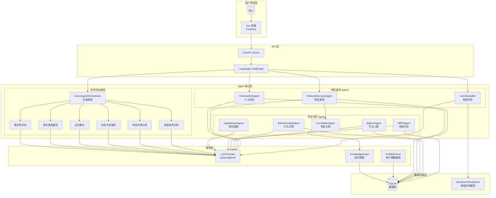
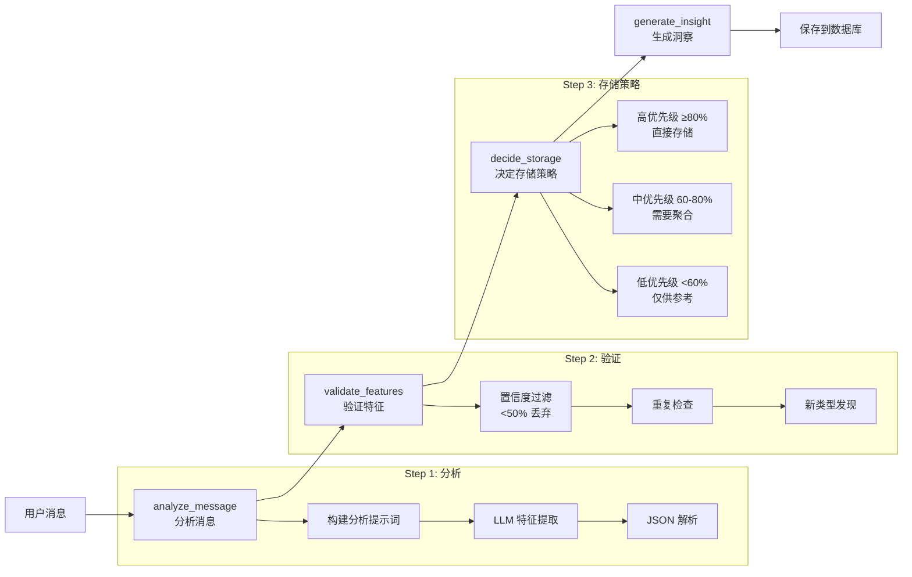
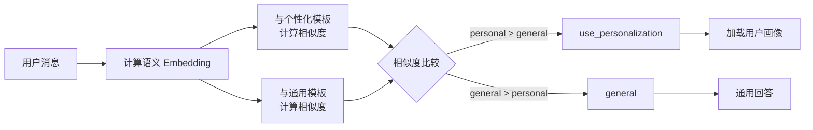
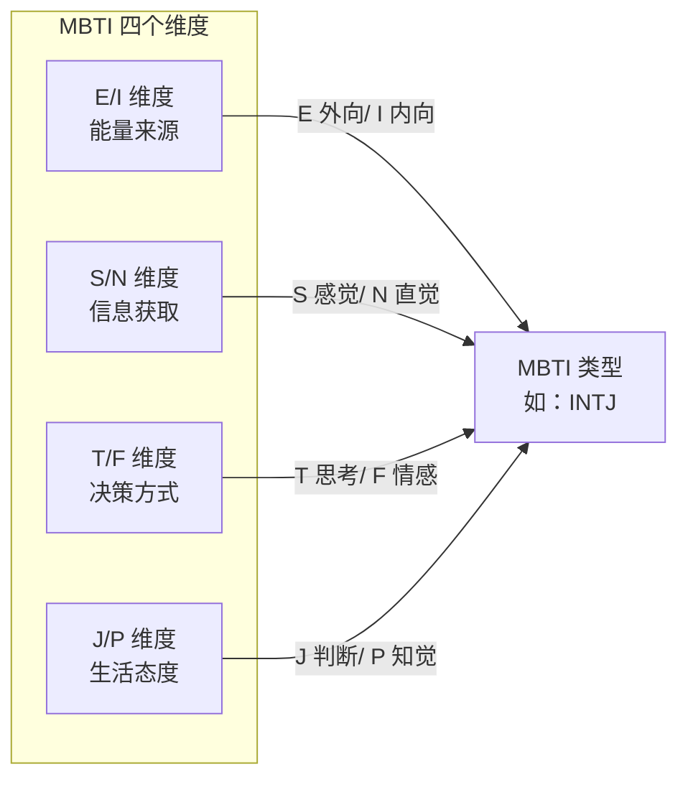
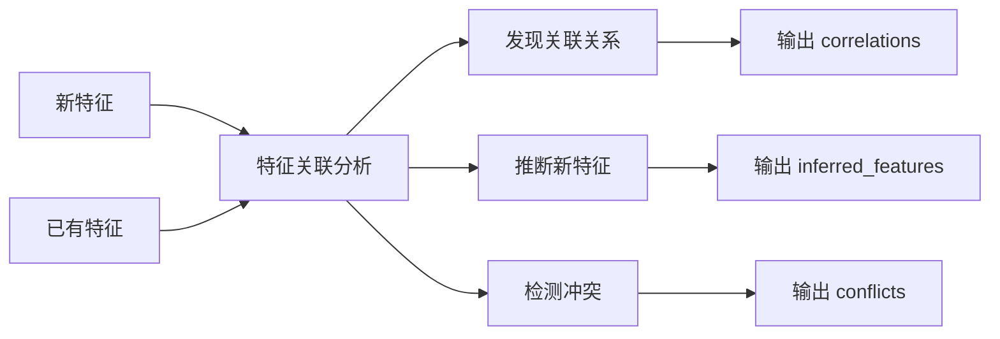
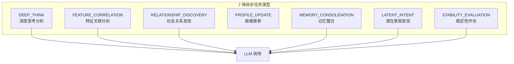
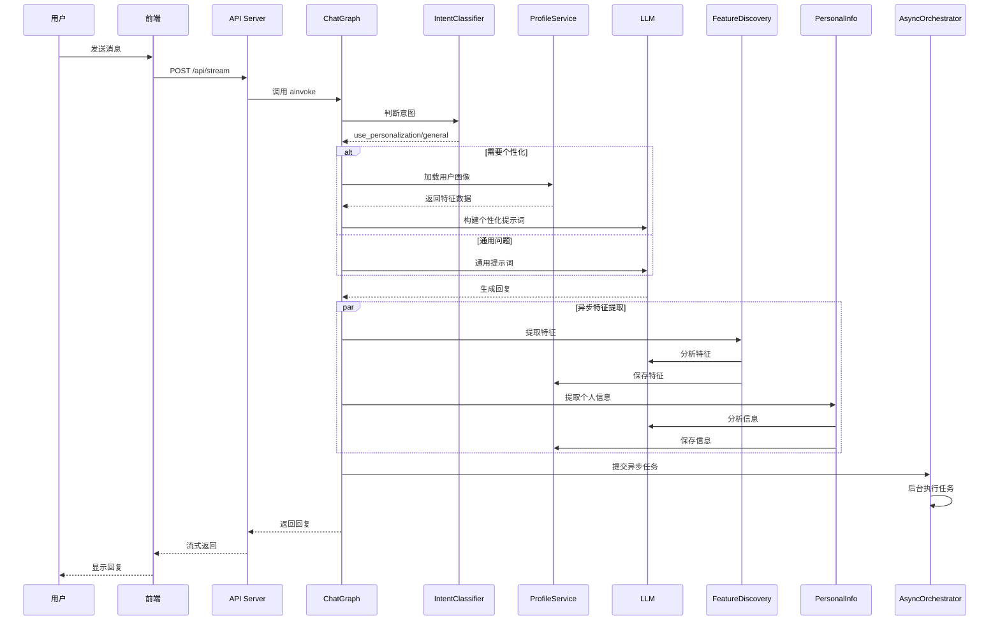
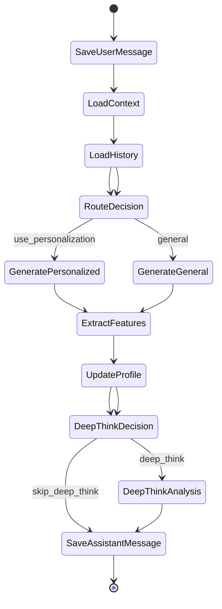
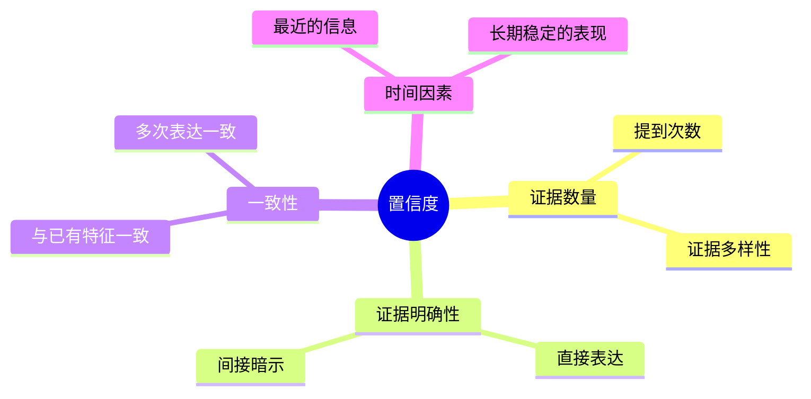

# Agent 自进化系统设计方案

## 1. 系统概述

MindPeek 的 Agent 系统是一个**多层次、协作式**的智能分析架构。系统通过多个专业 Agent 的协同工作，实现对用户特征的全面挖掘、性格分析、行为预测等功能。Agent 系统采用异步任务编排，支持并发执行，能够在用户对话过程中后台进行深度分析。

### 1.1 核心设计理念

- **专业化分工**：每个 Agent 专注于特定领域，避免功能耦合
- **协作式分析**：通过编排器协调多 Agent 协作，形成完整的分析链路
- **自进化能力**：特征提取和置信度评估能够根据反馈持续优化
- **异步执行**：后台任务不阻塞主对话流程，用户体验流畅

### 1.2 系统架构图



---

## 2. Agent 详解

### 2.1 FeatureDiscoveryAgent（特征发现 Agent）

**职责**：基于 LangGraph 构建的自主特征发现 Agent，能够动态判断用户特征，自主决定记录哪些特征以及如何分类。

**核心能力**：

1. **自主特征识别**：能够从用户对话中识别预定义的 14 种特征类型
2. **新特征发现**：发现不适合已有分类的信息，提出新的分类建议
3. **置信度评估**：根据证据充分程度评估置信度（0-100%）
4. **去重机制**：避免重复记录相似特征

**预定义的 14 种特征类型**：

| 类型 | 说明 |
|------|------|
| MBTI | 性格类型（INTJ、ENFP 等） |
| 大五人格 | 开放性、尽责性、外向性、宜人性、神经质 |
| 行为习惯 | 作息、消费、社交、沟通、工作习惯 |
| 潜在想法 | 未明说的需求、顾虑、偏好 |
| 兴趣爱好 | 娱乐、学习、运动等爱好 |
| 价值观 | 人生观、世界观、价值取向 |
| 情感状态 | 当前情绪、心理状态 |
| 生活偏好 | 生活方式、环境偏好 |
| 沟通风格 | 表达方式、沟通习惯 |
| 思维模式 | 思考方式、决策模式 |
| 社交特点 | 人际交往特点 |
| 工作风格 | 工作习惯、职业特点 |
| 个人信息 | 姓名、年龄、职业、居住地等 |
| 社会关系 | 家人、朋友、同事等关系 |

**工作流程**：



**存储优先级策略**：

| 置信度 | 存储优先级 | 是否需要聚合 | 说明 |
|--------|-----------|--------------|------|
| ≥80% | 高 | 否 | 特征明确，可直接使用 |
| 60%-80% | 中 | 是 | 需要更多证据支持 |
| <60% | 低 | 是 | 仅供参考，需要聚合 |
| MBTI/大五人格 | 高 | 否 | 人格特征默认高优先级 |

---

### 2.2 IntentClassifier（意图分类器）

**职责**：基于语义 Embedding 的智能意图判断，使用余弦相似度判断用户消息是否需要个性化处理。

**核心技术**：

- **模型**：SentenceTransformer (paraphrase-multilingual-MiniLM-L12-v2)
- **方法**：语义相似度计算
- **模板**：20 个个性化模板 + 20 个通用模板

**个性化模板示例**：
- "我最近感觉很焦虑"
- "我的性格是怎样的"
- "我喜欢看科幻电影"
- "我最近工作压力很大"

**通用模板示例**：
- "什么是人工智能"
- "如何学习 Python"
- "为什么天空是蓝色的"
- "介绍一下北京"

**判断流程**：



**应用场景**：

- 在用户发送消息时快速判断是否触发个性化对话
- 只有需要个性化的消息才会调用用户画像数据进行增强回答

---

### 2.3 PersonalInfoAgent（个人信息与关系提取 Agent）

**职责**：从对话中提取用户个人信息和关系信息。

**提取的信息类型**：

| 类别 | 字段 | 说明 |
|------|------|------|
| **基本信息** | name | 姓名 |
| | age | 年龄 |
| | gender | 性别 |
| | occupation | 职业 |
| | location | 居住地 |
| | education | 教育背景 |
| | marital_status | 婚姻状况 |
| **其他信息** | other_info | 爱好、习惯、经历等（带置信度） |
| **关系信息** | relationships | 人物名称、关系类型、关系描述、置信度 |

**特点**：

- 只提取对话中**明确提到**的信息，不进行推测
- 使用 JSON 格式返回结构化数据
- 支持批量处理对话历史
- 并行提取个人信息和关系信息

---

### 2.4 MBTIAgent（MBTI 性格分析 Agent）

**职责**：基于用户对话内容，分析推断用户的 MBTI 性格类型。

**MBTI 四个维度**：



**分析流程**：

1. 接收用户对话历史（最近 10 轮）
2. 读取已识别的 MBTI 特征（避免重复分析）
3. 对每个维度进行倾向分析，输出置信度
4. 综合四个维度给出最终 MBTI 类型

**输出格式**：

```json
{
    "dimensions": {
        "EI": {"tendency": "I", "confidence": 0.85, "evidence": "对话中表现出内敛..."},
        "SN": {"tendency": "N", "confidence": 0.72, "evidence": "关注抽象概念..."},
        "TF": {"tendency": "T", "confidence": 0.68, "evidence": "决策依据逻辑..."},
        "JP": {"tendency": "J", "confidence": 0.75, "evidence": "喜欢计划..."}
    },
    "mbti_type": "INTJ",
    "confidence": 0.72,
    "reasoning": "综合分析..."
}
```

---

### 2.5 BigFiveAgent（大五人格分析 Agent）

**职责**：分析用户的大五人格特质，提供更全面的人格特征描述。

**大五人格维度**：

| 维度 | 含义 | 高分特征 | 低分特征 |
|------|------|----------|----------|
| **开放性** | 好奇心、创造力 | 富有想象力、好奇 | 务实、传统 |
| **尽责性** | 自律、可靠性 | 有组织、负责任 | 随意、冲动 |
| **外向性** | 社交活跃度 | 开朗、自信 | 内向、含蓄 |
| **宜人性** | 信任他人程度 | 合作、同理心 | 怀疑、冷淡 |
| **神经质** | 情绪稳定性 | 敏感、焦虑 | 稳定、冷静 |

**分析输出**：

```json
{
    "traits": {
        "开放性": {"score": 75, "evidence": "对新技术感兴趣..."},
        "尽责性": {"score": 60, "evidence": "工作有计划..."},
        "外向性": {"score": 45, "evidence": "偏向内敛..."},
        "宜人性": {"score": 80, "evidence": "善于理解他人..."},
        "神经质": {"score": 55, "evidence": "偶尔焦虑..."}
    },
    "dominant_traits": ["开放性", "宜人性"],
    "overall_confidence": 0.78,
    "reasoning": "综合分析..."
}
```

---

### 2.6 BehaviorHabitAgent（行为习惯分析 Agent）

**职责**：识别用户的行为习惯模式。

**分析维度**：

1. **作息习惯**：早起/晚睡、作息规律性
2. **消费习惯**：理性/冲动、注重性价比/品质
3. **社交习惯**：线上/线下、社交频率
4. **沟通风格**：直接/委婉、表达方式
5. **学习/工作习惯**：计划性、执行力

**输出格式**：

```json
{
    "habits": [
        {
            "category": "作息",
            "habit": "喜欢晚睡晚起",
            "confidence": 0.8,
            "evidence": "用户提到经常凌晨 2 点睡觉"
        },
        {
            "category": "消费",
            "habit": "理性消费，注重性价比",
            "confidence": 0.75,
            "evidence": "多次比较价格后购买"
        }
    ],
    "confidence": 0.78,
    "reasoning": "综合分析..."
}
```

---

### 2.7 ImplicitIntentAgent（隐性意图分析 Agent）

**职责**：识别用户的隐性意图和潜在想法。

**分析重点**：

1. **未明说的需求**：用户真正想要什么？
2. **潜在顾虑**：用户担心什么？
3. **隐藏偏好**：用户没有直接表达但暗示的偏好
4. **情感状态**：用户当前的情绪和心理状态

**输出格式**：

```json
{
    "implicit_intents": [
        {
            "type": "未明说需求",
            "content": "需要情感支持",
            "confidence": 0.75,
            "evidence": "多次提到孤独感",
            "suggestion": "给予更多关怀和鼓励"
        }
    ],
    "emotional_state": {
        "primary_emotion": "焦虑",
        "intensity": 0.6,
        "indicators": ["频繁使用焦虑相关词汇"]
    },
    "confidence": 0.7,
    "reasoning": "综合分析..."
}
```

---

### 2.8 CorrelationAgent（特征关联分析 Agent）

**职责**：发现特征之间的关联关系，推断新特征。

**核心功能**：

1. **关联发现**：找出新特征与已有特征的关联
2. **特征推断**：基于关联推断用户可能具备的其他特征
3. **冲突检测**：检测特征之间的矛盾

**工作流程**：



**输出示例**：

```json
{
    "correlations": [
        {
            "source": "喜欢阅读科幻小说",
            "target": "开放性高",
            "relation": "correlates_with",
            "weight": 0.7
        }
    ],
    "inferred_features": [
        {
            "inferred_feature": "可能对科技新闻感兴趣",
            "based_on": ["喜欢阅读科幻小说", "开放性高"],
            "confidence": 0.65,
            "reasoning": "开放性高的人通常对新事物感兴趣"
        }
    ]
}
```

---

### 2.9 PredictionAgent（行为预测 Agent）

**职责**：基于用户历史特征和行为模式，预测用户未来最有可能的行为或想法。

**预测维度**：

| 类别 | 说明 | 示例 |
|------|------|------|
| **行为预测** | 用户可能采取的行动 | "可能会开始学习新技能" |
| **想法预测** | 用户可能产生的思考 | "可能会考虑职业转型" |
| **情感预测** | 用户可能出现的情绪 | "可能会感到焦虑" |
| **决策预测** | 用户可能做出的选择 | "可能会选择在线课程" |

**时间范围**：

- **短期**（1-7 天）：即将发生的想法或行为
- **中期**（1-4 周）：未来的规划或倾向
- **长期**（1-3 月）：性格相关的行为模式

**预测输出示例**：

```json
[
    {
        "prediction": "用户可能会开始学习一门新技能",
        "category": "行为",
        "confidence": 0.85,
        "reasoning": "用户表现出强烈的好奇心（开放性 75 分），近期多次提到想要自我提升",
        "timeframe": "中期",
        "observable_signals": ["关注在线课程平台", "询问学习建议"]
    }
]
```

---

### 2.10 AsyncAgentOrchestrator（异步任务编排器）

**职责**：管理和调度后台 Agent 任务的异步执行。

**核心特性**：

1. **任务队列管理**：支持任务提交、调度、执行、完成的完整生命周期
2. **并发控制**：可配置最大并发数（默认 3 个），避免资源竞争
3. **优先级调度**：高优先级任务可以插队执行
4. **状态追踪**：每个任务都有明确的状态（pending/running/completed/failed）

**任务类型枚举**：



**异步任务详解**：

#### DEEP_THINK（深度思考分析）

- **输入**：用户消息、对话历史、用户特征
- **处理**：结合用户画像进行深度心理分析
- **输出**：
  - deep_analysis：深度分析内容
  - emotional_state：当前情绪状态
  - potential_needs：潜在需求列表
  - personality_insights：人格洞察

#### FEATURE_CORRELATION（特征关联分析）

- **输入**：新特征列表、已有特征列表
- **处理**：发现特征之间的关联关系
- **输出**：
  - correlations：关联列表
  - inferred_features：推断的新特征

#### RELATIONSHIP_DISCOVERY（社会关系发现）

- **输入**：用户消息、对话历史
- **处理**：识别对话中提到的人物及关系
- **输出**：
  - relationships：关系列表（人物、关系类型、互动模式）
  - social_insights：社会关系洞察

#### MEMORY_CONSOLIDATION（记忆整合）

- **输入**：用户 ID、最近特征列表
- **处理**：整合碎片化信息，强化重要记忆
- **输出**：
  - consolidated_features：整合后的特征
  - summary：记忆摘要

#### LATENT_INTENT（潜在意图发现）

- **输入**：用户消息、对话历史、已有特征
- **处理**：挖掘用户未明确表达的潜在需求
- **输出**：
  - latent_needs：隐性需求列表
  - behavior_predictions：行为预测

#### STABILITY_EVALUATION（稳定性评估）

- **输入**：特征类型、特征值、已有特征
- **处理**：评估特征的稳定性，计算衰减率
- **输出**：
  - stability_period_days：稳定期（天数）
  - decay_rate：衰减率
  - change_likelihood：变化可能性（low/medium/high）

**稳定性评估标准**：

| 特征类型 | 稳定期 | 衰减率 | 示例 |
|---------|--------|--------|------|
| **高度稳定** | 60-180 天 | 0.01-0.02 | MBTI、核心价值观 |
| **中等稳定** | 30-60 天 | 0.03-0.06 | 兴趣爱好、生活偏好 |
| **易变特征** | 7-14 天 | 0.08-0.15 | 情感状态、临时想法 |

---

## 3. 协作流程

### 3.1 对话时的 Agent 触发流程



### 3.2 LangGraph ChatGraph 状态流转



---

## 4. 置信度体系

### 4.1 置信度等级

| 等级 | 范围 | 说明 | 处理方式 |
|------|------|------|----------|
| **高** | 80-100% | 特征明确，可直接使用 | 直接存储，无需聚合 |
| **中** | 60-80% | 需要更多证据支持 | 需要聚合 |
| **低** | 40-60% | 仅供参考，需要聚合 | 需要聚合 |
| **待定** | <40% | 证据不足，不记录 | 丢弃 |

### 4.2 置信度影响因素



### 4.3 时间衰减机制

为了保持用户画像的时效性和准确性，系统采用**对数衰减函数**对特征置信度进行时间衰减。

**衰减函数公式**：

```
decayed_confidence = initial_confidence - (log_decay * confidence_range * 0.3)
```

其中：
- `log_decay = math.log1p(days_after_stability * decay_rate)`
- `confidence_range = initial_confidence - min_confidence`
- `days_after_stability = days_since_confirmed - stability_period_days`

**衰减机制特点**：

1. **稳定期保护**：在稳定期内（由 LLM 评估，通常 30 天），置信度保持不变
2. **对数衰减**：超过稳定期后，使用对数函数缓慢衰减，避免剧烈变化
3. **最低阈值**：置信度不会低于最小阈值（默认 0.3）
4. **过期机制**：当置信度降至最低阈值且超过 180 天未确认，特征标记为过期

**特征衰减函数可视化**：


*上图展示了特征置信度随时间变化的衰减曲线：*
- *绿色区域为稳定期（30 天），置信度保持不变*
- *超过稳定期后，置信度按对数函数缓慢下降*
- *红色虚线为最小置信度阈值（0.3）*
- *灰色虚线为稳定期结束时间点*

**不同特征类型的衰减参数**：

| 特征类型 | 稳定期 | 衰减率 | 说明 |
|---------|--------|--------|------|
| **高度稳定** | 60-180 天 | 0.01-0.02 | MBTI、核心价值观等不易变化 |
| **中等稳定** | 30-60 天 | 0.03-0.06 | 兴趣爱好、生活偏好等 |
| **易变特征** | 7-14 天 | 0.08-0.15 | 情感状态、临时想法等 |

**衰减应用时机**：

- **写入时衰减**：每次更新特征时自动计算并应用衰减
- **读取时衰减**：获取特征列表时实时计算衰减值（只读，不写数据库）
- **定期清理**：后台任务定期扫描并标记过期特征

---

## 5. 数据存储

### 5.1 特征存储结构

```json
{
    "user_id": "用户 ID",
    "feature_type": "特征类型",
    "feature_value": "特征值",
    "confidence": 0.85,
    "evidence": ["证据 1", "证据 2"],
    "source": "对话/推断/聚合",
    "created_at": "创建时间",
    "updated_at": "更新时间",
    "is_verified": false
}
```

### 5.2 预测结果存储

```json
{
    "user_id": "用户 ID",
    "prediction": "预测内容",
    "category": "行为/想法/情感/决策",
    "confidence": 0.75,
    "reasoning": "推断依据",
    "timeframe": "短期/中期/长期",
    "observable_signals": ["信号 1", "信号 2"],
    "is_fulfilled": null,
    "created_at": "创建时间"
}
```

---

## 6. 设计优势

### 6.1 模块化设计

- 每个 Agent 独立负责特定领域
- 便于单独优化和扩展
- 降低系统耦合度

### 6.2 异步非阻塞

- 后台任务不阻塞主对话
- 用户体验流畅
- 资源利用率高

### 6.3 自进化机制

- 置信度体系支持动态调整
- 特征去重避免冗余
- 新特征发现机制

### 6.4 协作式分析

- 多 Agent 协同工作
- 特征关联发现
- 全面立体的用户画像

---

## 7. 未来优化方向

1. **增量学习**：支持在线学习，持续优化特征模型
2. **跨用户迁移**：利用相似用户的特征进行冷启动优化
3. **情感动态追踪**：追踪用户情感状态的时间变化
4. **预测反馈闭环**：验证预测准确性并优化模型
5. **多模态融合**：支持图像、语音等更多数据类型
